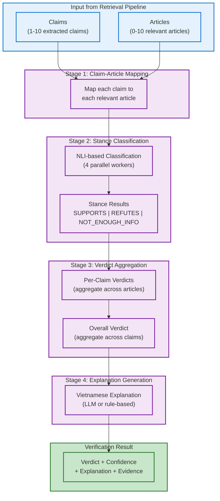

# Backend: Verification Pipeline

## What It Is

The Verification Pipeline is the second major processing stage in VeriNews, responsible for validating claims from social media posts against retrieved articles. It uses Natural Language Inference (NLI) techniques to classify stance, aggregate verdicts, and generate human-readable Vietnamese explanations.

## Overview

After the Retrieval Pipeline finds relevant articles, the Verification Pipeline:
1. Maps extracted claims to retrieved articles
2. Classifies the stance of each article toward each claim (SUPPORTS/REFUTES/NOT_ENOUGH_INFO)
3. Aggregates stances into overall verdicts per claim and for the entire post
4. Generates a natural Vietnamese explanation with confidence metrics

**Key Characteristics:**
- **Always Runs**: Even on cache hits (retrieval results cached, verification runs fresh)
- **Parallel Processing**: 4 concurrent workers for stance classification
- **Multi-Claim Support**: Handles up to 10 claims per post
- **Vietnamese Output**: All explanations in natural Vietnamese language

## Architecture



## Stage 1: Claim-Article Mapping

**Purpose**: Create claim-article pairs for stance classification

**How it works**:
- Takes N claims (from Query Extraction) and M articles (from Retrieval)
- Creates N × M pairs (e.g., 5 claims × 10 articles = 50 pairs)
- Each pair will be evaluated independently

**Example**:
```
Claim 1: "Prime Minister announced new tax policy"
  → Article 1: "Government unveils tax reform..."
  → Article 2: "Economic changes proposed..."
  → Article 3: "Tax rates remain unchanged..."

Claim 2: "New policy takes effect in January"
  → Article 1: "Government unveils tax reform..."
  → Article 2: "Economic changes proposed..."
  → Article 3: "Tax rates remain unchanged..."
```

**Output**: List of (claim, article) tuples ready for classification

---

## Stage 2: Stance Classification

**Location**: `backend/app/services/verification/stance_classifier_service.py`

**What it does**: Classifies whether articles support, refute, or don't provide enough information for claims

### Classification Labels

**SUPPORTS**: Article directly supports the claim
- Article confirms the claim with evidence
- Key facts align with the claim
- No contradictions present

**REFUTES**: Article contradicts or refutes the claim
- Article provides evidence against the claim
- Key facts contradict the claim
- Direct contradiction present

**NOT_ENOUGH_INFO**: Article doesn't provide sufficient evidence
- Article mentions related topics but lacks specifics
- Not enough detail to confirm or deny
- Ambiguous or unclear relationship

### Implementation Details

**LLM Configuration**:
- **Model**: gpt-4o-mini (configurable via `config.yaml`)
- **Task Type**: Natural Language Inference (NLI)
- **Prompt Language**: Vietnamese (instructions in Vietnamese)
- **Temperature**: 0 (deterministic)
- **Max Tokens**: 1,000 per response
- **Prompt Size**: ~1,000 tokens per claim-article pair

**Parallel Processing**:
- **Num Workers**: 4 concurrent workers
- **Timeout**: 10 seconds per worker
- **Batch Strategy**: Round-robin distribution
- **Concurrency Limit**: 4 max concurrent API calls
- **Distribution**: 50 pairs ÷ 4 workers = ~12-13 pairs per worker

**Round-Robin Distribution Example**:
```python
# For 50 claim-article pairs, 4 workers:
Worker 0: [pair_0, pair_4, pair_8, ...]   # 13 pairs
Worker 1: [pair_1, pair_5, pair_9, ...]   # 13 pairs
Worker 2: [pair_2, pair_6, pair_10, ...]  # 12 pairs
Worker 3: [pair_3, pair_7, pair_11, ...]  # 12 pairs
```

**Prompt Structure** (~1,000 tokens):
```
System: Bạn là một chuyên gia xác minh thông tin...

Task: Phân loại mối quan hệ giữa tuyên bố và bài viết:
- SUPPORTS: Bài viết hỗ trợ tuyên bố
- REFUTES: Bài viết bác bỏ tuyên bố
- NOT_ENOUGH_INFO: Không đủ thông tin

Tuyên bố: [claim text]
Bài viết: [article content]

Trả về JSON:
{
  "stance": "SUPPORTS | REFUTES | NOT_ENOUGH_INFO",
  "confidence": 0.0-1.0,
  "evidence_spans": [
    {"text": "...", "reasoning": "..."}
  ],
  "overall_reasoning": "..."
}
```

**Evidence Extraction**:
- **Evidence Spans**: Direct quotes from article supporting/refuting claim
- **Reasoning**: Explanation of why the quote is relevant
- **Confidence Score**: 0.0-1.0 confidence in the stance classification

**Output Structure**:
```python
{
    "stance": "SUPPORTS",  # or REFUTES, NOT_ENOUGH_INFO
    "confidence": 0.92,
    "evidence_spans": [
        {
            "text": "Thủ tướng Phạm Minh Chính công bố chính sách thuế mới...",
            "reasoning": "Trích dẫn này xác nhận Thủ tướng đã công bố chính sách thuế"
        }
    ],
    "overall_reasoning": "Bài viết xác nhận rõ ràng tuyên bố về việc Thủ tướng công bố chính sách thuế mới"
}
```

**Error Handling**:
- **Worker Timeout** (>10s): Returns default `NOT_ENOUGH_INFO` with 0.0 confidence
- **JSON Parse Failure**: Returns default `NOT_ENOUGH_INFO`
- **Missing Fields**: Uses sensible defaults (empty arrays, 0.0 confidence)
- **Logged**: All failures logged as warnings with worker ID

**Minimum Confidence Threshold**: 0.6 (60%)
- Stances with confidence < 0.6 are treated as `NOT_ENOUGH_INFO`
- Prevents low-confidence classifications from affecting verdict

**Token Cost**:
- **Input per pair**: ~1,000 tokens (prompt + claim + article excerpt)
- **Output per pair**: ~150 tokens (JSON with evidence)
- **Total per request**: 50 pairs × 1,150 tokens = ~57,500 tokens
- **Cost**: ~$0.01-0.02 per verification request (at GPT-4o-mini rates)

---

## Stage 3: Verdict Aggregation

**Location**: `backend/app/services/verification/verdict_aggregator_service.py`

**What it does**: Combines stance classifications into claim verdicts and an overall verdict

### Aggregation Logic

**Step 1: Per-Claim Verdict**

For each claim, count stances across all articles:
```python
claim_stances = {
    "SUPPORTS": 7,      # 7 articles support
    "REFUTES": 1,       # 1 article refutes
    "NOT_ENOUGH_INFO": 2 # 2 articles don't have info
}
```

**Verdict Rules** (configurable mode: conservative):
- **SUPPORTED**: If majority of articles SUPPORT (>50%) and no REFUTES
- **REFUTED**: If any article REFUTES with confidence ≥ 0.8
- **PARTIALLY_SUPPORTED**: If mixed SUPPORTS and REFUTES
- **NOT_ENOUGH_INFO**: If majority is NOT_ENOUGH_INFO or no clear majority

**Step 2: Overall Verdict**

Aggregate across all claims:
```python
claim_verdicts = {
    "SUPPORTED": 3,           # 3 claims fully supported
    "PARTIALLY_SUPPORTED": 1, # 1 claim partially supported
    "REFUTED": 0,             # 0 claims refuted
    "NOT_ENOUGH_INFO": 1      # 1 claim lacks evidence
}
```

**Overall Verdict Rules** (worst-case evaluation):
- **FULLY_SUPPORTED**: All claims SUPPORTED
- **PARTIALLY_SUPPORTED**: Mix of SUPPORTED and PARTIALLY_SUPPORTED
- **REFUTED**: Any claim REFUTED
- **NOT_ENOUGH_INFO**: All claims are NOT_ENOUGH_INFO, or no articles found

**Confidence Calculation**:

Multi-signal confidence based on 5 weighted factors:

```python
verification_confidence = (
    0.30 * evidence_quality +      # Average stance confidence across claims
    0.25 * source_agreement +      # How consistently sources agree
    0.25 * stance_confidence +     # Average confidence of all stances
    0.15 * claim_coverage +        # % of claims with evidence (≥1 article)
    0.05 * temporal_relevance      # Article freshness vs claim context
)
```

**Signal Details**:

1. **Evidence Quality** (30% weight):
   - Average confidence of all stance classifications
   - Higher = more confident LLM classifications

2. **Source Agreement** (25% weight):
   - Consistency across sources for same claim
   - Formula: `1 - (stddev of stances / mean stance confidence)`
   - Higher = sources agree with each other

3. **Stance Confidence** (25% weight):
   - Average confidence from NLI model
   - Measures model certainty

4. **Claim Coverage** (15% weight):
   - Percentage of claims with at least 1 supporting/refuting article
   - Formula: `(claims with evidence) / (total claims)`

5. **Temporal Relevance** (5% weight):
   - How recent articles are relative to claim context
   - Fresher articles = higher relevance

**Confidence Tiers**:
```python
if verification_confidence >= 0.75:
    tier = "HIGH"        # Strong evidence, high agreement
elif verification_confidence >= 0.50:
    tier = "MEDIUM"      # Moderate evidence
elif verification_confidence >= 0.25:
    tier = "LOW"         # Weak evidence
else:
    tier = "NONE"        # No reliable evidence
```

**Output Structure**:
```python
{
    "verdict": "PARTIALLY_SUPPORTED",
    "confidence": 0.78,
    "confidence_tier": "HIGH",
    "total_claims": 5,
    "supported_claims": 3,
    "refuted_claims": 0,
    "claim_verdicts": [
        {
            "claim_text": "Prime Minister announced new tax policy",
            "verdict": "SUPPORTED",
            "confidence": 0.92,
            "supporting_evidence": [
                {
                    "article_id": "uuid",
                    "article_title": "Government unveils tax reform",
                    "stance": "SUPPORTS",
                    "confidence": 0.95,
                    "evidence_spans": [...]
                }
            ],
            "refuting_evidence": []
        },
        # ... more claims
    ],
    "sources_used": ["Thanh Niên", "Tuổi Trẻ", "VNExpress"],
    "confidence_metrics": {
        "evidence_quality": 0.88,
        "source_agreement": 0.82,
        "stance_confidence": 0.90,
        "claim_coverage": 0.80,
        "temporal_relevance": 0.75
    }
}
```

---

## Stage 4: Explanation Generation

**Location**: `backend/app/services/verification/explanation_generator_service.py`

**What it does**: Generates human-readable Vietnamese explanations of verification results

### Processing Modes

**1. Rule-Based Mode** (Simple cases, ~0 tokens):

Used for straightforward scenarios:
- **No articles found**: "Không tìm thấy bài viết liên quan để xác minh thông tin này."
- **No claims extracted**: "Không tìm thấy tuyên bố cụ thể có thể xác minh trong nội dung này."
- **All claims supported**: "Đáng tin cậy. Tất cả {N} tuyên bố đều được xác nhận bởi {M} nguồn tin đáng tin cậy."
- **All claims refuted**: "Thông tin không chính xác. Tất cả tuyên bố đều bị bác bỏ bởi các nguồn tin đáng tin cậy."

**2. LLM Mode** (Complex cases, ~400 tokens):

Used for nuanced explanations:
- Mixed verdicts (PARTIALLY_SUPPORTED)
- Multiple conflicting sources
- Requires natural language reasoning

**LLM Configuration**:
- **Model**: gpt-4o-mini
- **Temperature**: 0.3 (slight creativity for natural language)
- **Max Tokens**: 150 (Vietnamese text is compact)
- **Max Length**: 500 characters (configurable)

**Prompt Structure**:
```
System: Bạn là một chuyên gia xác minh thông tin...

Task: Tạo giải thích ngắn gọn (tối đa 500 ký tự) bằng tiếng Việt về kết quả xác minh:

Verdict: PARTIALLY_SUPPORTED
Claims: 5 total (3 supported, 1 partially supported, 1 not enough info)
Sources: Thanh Niên, Tuổi Trẻ, VNExpress
Confidence: 0.78 (HIGH)

Claim Details:
1. [Claim 1]: SUPPORTED by 3 articles
2. [Claim 2]: PARTIALLY_SUPPORTED by 2 articles
3. [Claim 3]: NOT_ENOUGH_INFO
...

Generate natural Vietnamese explanation.
```

**3. Fallback Mode** (LLM failure):

If LLM fails or times out:
- Falls back to rule-based explanation
- Logged as warning for debugging
- Ensures user always gets an explanation

### Verdict Mapping (Vietnamese)

```python
VERDICT_LABELS_VI = {
    "FULLY_SUPPORTED": "ĐÁNG TIN CẬY",
    "PARTIALLY_SUPPORTED": "ĐÚNG MỘT PHẦN",
    "REFUTED": "SAI SỰ THẬT",
    "NOT_ENOUGH_INFO": "CHƯA ĐỦ BẰNG CHỨNG"
}
```

### Example Outputs

**Example 1: Fully Supported (Rule-based)**
```
Input:
- Verdict: FULLY_SUPPORTED
- Claims: 3/3 supported
- Sources: 5 articles (Thanh Niên, Tuổi Trẻ, VNExpress)

Output:
"Hoàn toàn đáng tin cậy. Cả 3 tuyên bố đều được xác nhận bởi 5 nguồn tin đáng tin cậy bao gồm Thanh Niên, Tuổi Trẻ và VNExpress."
```

**Example 2: Partially Supported (LLM-based)**
```
Input:
- Verdict: PARTIALLY_SUPPORTED
- Claims: 3 total (2 supported, 1 not enough info)
- Sources: 4 articles

Output:
"Thông tin này đúng một phần. Hai trong ba tuyên bố được xác nhận bởi các nguồn tin uy tín. Tuy nhiên, tuyên bố thứ ba về thời gian áp dụng chính sách chưa có đủ bằng chứng từ các bài viết tin tức."
```

**Example 3: Refuted (Rule-based)**
```
Input:
- Verdict: REFUTED
- Claims: 3 total (0 supported, 3 refuted)
- Sources: 6 articles

Output:
"Thông tin không chính xác. Các nguồn tin đáng tin cậy đã bác bỏ tất cả các tuyên bố trong nội dung này. Vui lòng kiểm tra lại thông tin từ các nguồn chính thống."
```

**Example 4: Not Enough Info (Rule-based)**
```
Input:
- Verdict: NOT_ENOUGH_INFO
- Claims: 0 articles found

Output:
"Không tìm thấy bài viết liên quan để xác minh thông tin này. Có thể đây là thông tin mới chưa được đưa tin, hoặc không có trong cơ sở dữ liệu của chúng tôi."
```

**Token Cost**:
- **Rule-based**: ~0 tokens (pure logic)
- **LLM-based**: ~400 tokens (prompt ~250 + response ~150)
- **Cost**: ~$0.0005 per LLM explanation

---

## Configuration

### Verification Pipeline Settings (from `config.yaml`)

```yaml
verification:
  enabled: true

  stance_classification:
    num_parallel_workers: 4           # Concurrent workers for stance classification
    worker_timeout_seconds: 10        # Timeout per worker
    min_confidence: 0.6               # Minimum stance confidence threshold
    max_concurrent_calls: 4           # Rate limiting

  verdict_aggregation:
    min_evidence_per_claim: 1         # Minimum articles per claim
    conflict_resolution_mode: "conservative"  # conservative | permissive
    verdict_mode: "worst_case"        # worst_case | majority
    confidence_weights:
      evidence_quality: 0.30          # Average stance confidence
      source_agreement: 0.25          # Cross-source consistency
      stance_confidence: 0.25         # NLI model confidence
      claim_coverage: 0.15            # % claims with evidence
      temporal_relevance: 0.05        # Article freshness
    confidence_thresholds:
      high: 0.75
      medium: 0.50
      low: 0.25

  explanation:
    language: "vi"                    # Vietnamese output
    max_length: 500                   # Max characters
    use_llm_for_complex: true         # LLM for complex verdicts
    llm_temperature: 0.3              # Slight creativity
```

### AI Provider Settings

```yaml
ai:
  provider: "openai"
  llm_model: "gpt-4o-mini"            # For stance classification & explanation
  max_retries: 3
  timeout_seconds: 30
```

---

## Cost Analysis

### Token Breakdown per Verification Request

**Stance Classification** (Stage 2):
- **Input**: 50 pairs × 1,000 tokens = 50,000 tokens
- **Output**: 50 pairs × 150 tokens = 7,500 tokens
- **Total**: ~57,500 tokens
- **Cost**: ~$0.009 (input) + ~$0.005 (output) = **$0.014**

**Explanation Generation** (Stage 4):
- **Input**: ~250 tokens (prompt)
- **Output**: ~150 tokens (response)
- **Total**: ~400 tokens
- **Cost**: **$0.0005**

**Total Verification Pipeline Cost**: **~$0.015 per request**

**Monthly Costs** (assuming cache reduces retrieval, but verification always runs):
- **100 requests/day**: $1.50/day = **$45/month**
- **1,000 requests/day**: $15/day = **$450/month**

**Note**: Retrieval pipeline adds ~$0.005-0.009 on cache miss (see `04-backend-ai-ml-services.md`)

---

## Implementation Status

### Fully Implemented ✅

- ✅ Claim-Article Mapping
- ✅ Stance Classification Service (NLI-based, parallel workers)
- ✅ Verdict Aggregation Service (multi-signal confidence)
- ✅ Explanation Generator Service (rule-based + LLM modes)
- ✅ Vietnamese language support
- ✅ Error handling and fallback mechanisms
- ✅ Parallel processing with timeouts
- ✅ Confidence scoring (5-signal calculation)

### Configuration Options ⚙️

All verification settings are configurable via `backend/config/config.yaml`:
- Worker counts and timeouts
- Confidence thresholds
- Aggregation modes (conservative vs permissive)
- Explanation length and language
- LLM model selection

---

## Performance Characteristics

**Typical Verification Times**:
- **Claim-Article Mapping**: 100-200ms (pure Python)
- **Stance Classification**: 1,000-2,000ms (parallel LLM calls)
- **Verdict Aggregation**: 100-200ms (pure Python)
- **Explanation Generation**: 200-400ms (rule-based or LLM)
- **Total Verification Pipeline**: **1,400-2,800ms**

**Bottlenecks**:
- Stance Classification is the slowest stage (LLM API calls)
- Parallelization (4 workers) reduces latency from ~10s to ~2s

**Optimization Strategies**:
- Increase workers (trade cost for speed)
- Reduce timeout for faster failures
- Use rule-based explanations more aggressively
- Cache stance results for repeated claim-article pairs (future)

---

## What's NOT Implemented

- ❌ Cross-claim consistency checking (detecting contradictions between claims)
- ❌ Temporal reasoning beyond date matching
- ❌ Multi-hop reasoning (claims requiring multiple articles to verify)
- ❌ User feedback loop (learn from user corrections)
- ❌ Explanation customization (length, detail level per user)
- ❌ Multi-language support (currently Vietnamese only)

---

## Related Documentation

- **Retrieval Pipeline**: See `02-backend-retrieval-pipeline.md` for how articles are found
- **AI/ML Services**: See `04-backend-ai-ml-services.md` for LLM provider details
- **API Layer**: See `01-backend-api-layer.md` for endpoint details
- **Database**: See `05-backend-database.md` for data models
