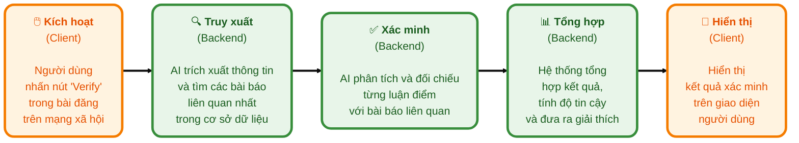
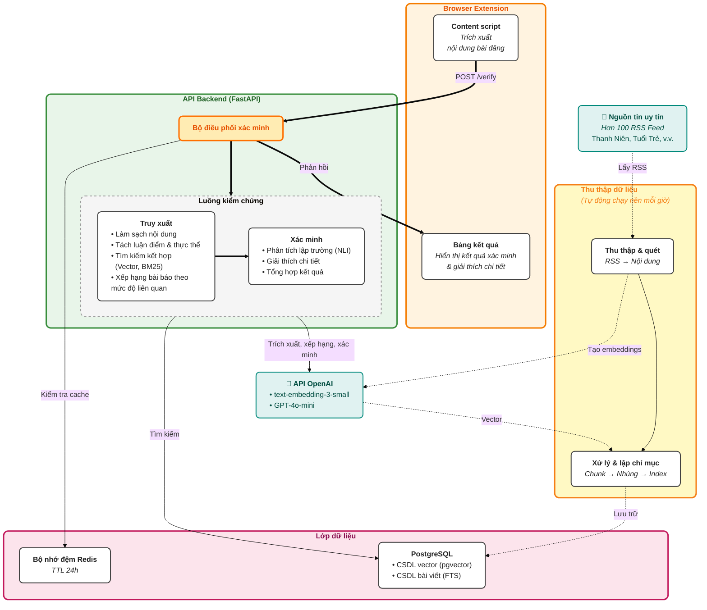
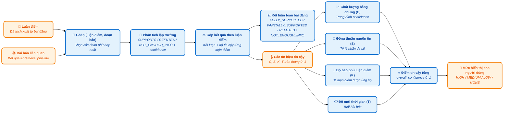
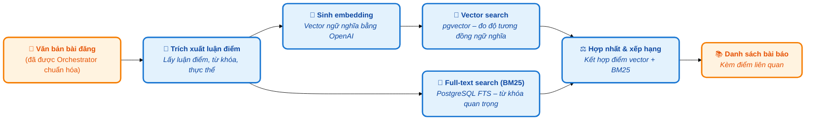
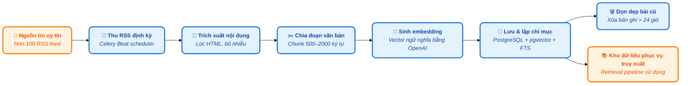

### User usage flow

### System overview

### Verification pipeline (Luồng kiểm chứng thông tin)

### Retrieval pipeline (Luồng truy xuất thông tin)

### Data ingestion pipeline (Luồng nạp dữ liệu)

### Caching pipeline (Luồng cache tối ưu thời gian phản hồi)

```mermaid
---
config:
  theme: base
  themeVariables:
    fontSize: 16px
    fontFamily: Arial
  layout: dagre
---
flowchart LR
    Post["📝 <b>Bài đăng cần kiểm chứng</b><br><i>Nội dung văn bản đầy đủ</i>"]
    Hash["🔐 <b>Tính mã băm nội dung</b><br><i>SHA-256(post_text)</i>"]
    Check["📦 <b>Kiểm tra cache</b><br><i>Redis: key = hash</i>"]

    Hit["⚡ <b>Cache hit</b><br><i>Đã có kết quả trước đó</i>"]
    Miss["🐢 <b>Cache miss</b><br><i>Chưa từng xử lý nội dung này</i>"]

    Pipelines["🧠 <b>Chạy đầy đủ pipeline</b><br><i>Truy vấn + Xác minh</i>"]
    Save["💾 <b>Lưu kết quả vào Redis</b><br><i>TTL ≈ 24 giờ</i>"]
    Result["📱 <b>Trả kết quả cho người dùng</b><br><i>Kết luận + điểm tin cậy + giải thích</i>"]

    Post --> Hash --> Check
    Check -->|Có trong cache| Hit --> Result
    Check -->|Không có| Miss --> Pipelines --> Save --> Result

    classDef stepStyle fill:#e3f2fd,stroke:#1976d2,stroke-width:3px,color:#0d47a1,rx:10,ry:10
    classDef dataStyle fill:#fff3e0,stroke:#f57c00,stroke-width:3px,color:#e65100,rx:10,ry:10

    class Post,Result dataStyle
    class Hash,Check,Hit,Miss,Pipelines,Save stepStyle
```

### 6. Tổng quan hệ thống

#### 6.1 Thành phần

- **Đầu vào**: Người dùng Facebook chọn bài đăng cần kiểm chứng từ giao diện mạng xã hội.
- **Client (Chrome Extension MV3)**: Content script đọc nội dung bài đăng, popup/modal hiển thị kết quả và gửi yêu cầu `POST /verify` tới backend qua `chrome.runtime.sendMessage`.
- **Backend (FastAPI + workers)**: Service orchestrator thực thi chuỗi 9 bước: trích xuất truy vấn/luận điểm, tạo embedding bằng OpenAI `text-embedding-3-small`, truy xuất lai (pgvector + BM25), RRF fusion, rerank 100 đoạn bằng LLM, gộp theo bài báo, rerank cấp bài báo, tính điểm tin cậy đa tín hiệu và chặn kết quả dưới ngưỡng.
- **Cache & CSDL**: Redis lưu kết quả truy xuất trong 24h để tránh xử lý lại; PostgreSQL + pgvector lưu bài báo gốc, metadata và vector embedding.
- **Crawler**: Celery workers thu thập RSS chính thống, cắt đoạn–nhúng–lập chỉ mục; Celery Beat scheduler (chu kỳ mặc định 5 phút, điều chỉnh trong `backend/config/config.yaml`) đảm bảo dữ liệu luôn mới.

#### 6.2 Luồng dữ liệu

Bài đăng ➜ Content script ➜ Backend `/verify` (Embedding ➜ Truy xuất ➜ Tính điểm) ➜ Redis/PostgreSQL ➜ Modal hiển thị kết quả.

#### 6.3 Backend & pipeline

- **Tiếp nhận & kiểm tra trùng lặp**: API `/verify` nhận bài đăng, tạo phiên làm việc async và kiểm tra nhanh trong Redis xem bài này đã được xử lý trong 24 giờ gần nhất hay chưa. Nếu tìm thấy, hệ thống trả về kết quả tức thì nhưng vẫn chạy lại bước đánh giá để đảm bảo lập luận và cảnh báo luôn mới.
- **Truy xuất nhiều tầng**: Khi không có cache, backend khởi động chuỗi 9 bước gồm trích xuất truy vấn/luận điểm, tạo embedding OpenAI, truy xuất lai giữa pgvector và BM25, hợp nhất kết quả bằng Reciprocal Rank Fusion, rồi dùng LLM để sắp xếp lại 100 đoạn văn bản tiềm năng trước khi gộp thành bài báo. Mỗi bước đều có ghi nhận thời gian để theo dõi hiệu năng.
- **Đánh giá độ tin cậy**: Sau khi gộp bài, hệ thống tiếp tục chấm điểm ở cấp bài viết, tính toán các tín hiệu như độ phủ thực thể, sự khác biệt giữa các kết quả và mức độ khớp tiêu đề–nội dung để loại bỏ những đáp án có nguy cơ nhiễu.
- **Xác minh lập luận**: Từ danh sách bài báo cuối cùng, dịch vụ verification ghép từng claim với nguồn liên quan, dùng mô hình lập trường (stance) để xác định ủng hộ hay bác bỏ, tổng hợp thành kết luận chung và tạo lời giải thích tiếng Việt dễ hiểu cho người dùng cuối.

#### 6.4 Đặc điểm kỹ thuật

- Mã hóa văn bản bằng OpenAI embeddings để so khớp ngữ nghĩa, kết hợp truy xuất BM25 cho từ khóa hiếm.
- RRF fusion và reranking bằng GPT-4o-mini bảo đảm các đoạn/bài báo sát nội dung bài đăng trước khi tổng hợp.
- Redis caching giúp trả lời lần lặp lại trong ~ms; luôn có fallback chạy đầy đủ nếu cache miss.
- Celery Beat điều phối crawler định kỳ; interval cấu hình bằng `scheduler.crawler_interval_minutes`.
- Điểm tin cậy đa tín hiệu so sánh với nguồn báo chí, áp dụng trọng số theo độ phủ thực thể, độ giống tiêu đề và căn chỉnh thời gian/vị trí để cảnh báo khi kết quả yếu.

#### 6.5 Mục tiêu

Giúp người dùng xác thực thông tin trên mạng xã hội bằng cách tự động đối chiếu bài đăng với kho bài báo chính thống đã được chuẩn hóa và cập nhật liên tục.
