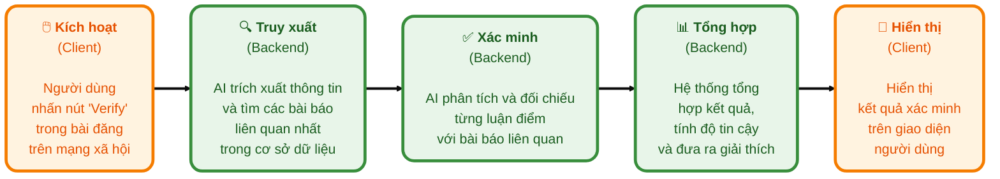
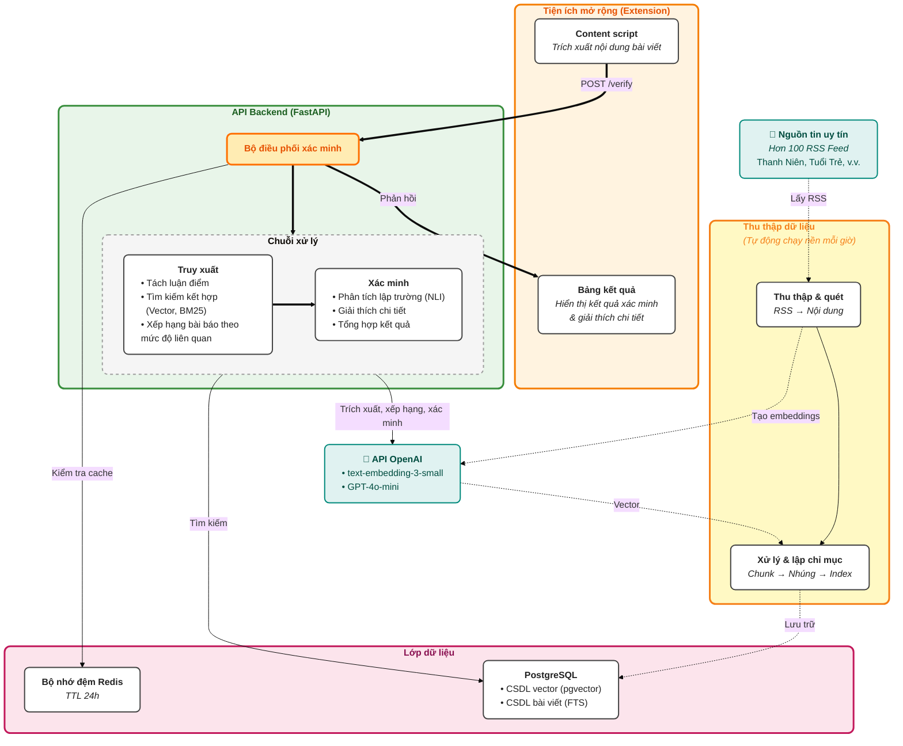

### User usage flow

```mermaid
%%{init: {'theme':'base', 'themeVariables': {'fontSize':'18px', 'fontFamily':'Arial'}}}%%
graph LR
    A["🖱️ <b>Kích hoạt</b><br/>(Client)<br/><br/>Người dùng<br/>nhấn nút 'Verify'<br/>trong bài đăng <br/> trên mạng xã hội"]

    B["🔍 <b>Truy xuất</b><br/>(Backend)<br/><br/>AI trích xuất thông tin<br/>và tìm các bài báo<br/>liên quan nhất<br/>trong cơ sở dữ liệu"]

    C["✅ <b>Xác minh</b><br/>(Backend)<br/><br/>AI phân tích và đối chiếu<br/>từng luận điểm<br/>với bài báo liên quan"]

    D["📊 <b>Tổng hợp</b><br/>(Backend)<br/><br/>Hệ thống tổng<br/>hợp kết quả,<br/>tính độ tin cậy<br/>và đưa ra giải thích"]

    E["📱 <b>Hiển thị</b><br/>(Client)<br/><br/>Hiển thị <br/> kết quả xác minh<br/>trên giao diện<br/>người dùng"]

    A ==> B
    B ==> C
    C ==> D
    D ==> E

    classDef clientStyle fill:#fff3e0,stroke:#f57c00,stroke-width:4px,color:#e65100,rx:15,ry:15
    classDef backendStyle fill:#e8f5e9,stroke:#388e3c,stroke-width:4px,color:#1b5e20,rx:15,ry:15

    class A,E clientStyle
    class B,C,D backendStyle
```

### System overview

```mermaid
%%{init: {'theme':'base', 'themeVariables': { 'fontSize':'16px'}}}%%
graph TD
    %% Browser Extension Layer
    subgraph BrowserExt["<b>Tiện ích mở rộng (Extension)</b>"]
        direction TB
        ContentScript["<b>Content script</b><br/><i>Trích xuất nội dung bài viết</i>"]
        ResultsPanel["<b>Bảng kết quả</b><br/><i>Hiển thị kết quả xác minh <br> & giải thích chi tiết</i>"]
    end

    %% Backend API Layer
    subgraph BackendAPI["<b>API Backend (FastAPI)</b>"]
        direction TB

        Orchestrator["<b>Bộ điều phối xác minh</b><br/>"]

        subgraph Pipeline["<b>Chuỗi xử lý</b>"]
            direction LR

            Retrieval["<b>Truy xuất</b><br/><div style='text-align:left'>• Tách luận điểm<br/>• Tìm kiếm kết hợp <br>  (Vector, BM25)<br/>• Xếp hạng bài báo theo mức độ liên quan</div>"]
            Verification["<b>Xác minh</b><br/><div style='text-align:left'>• Phân tích lập trường (NLI)<br/>• Giải thích chi tiết<br/>• Tổng hợp kết quả</div>"]

            Retrieval ==> Verification
        end

        Orchestrator ==> Pipeline
    end

    %% Data Layer (Left Side)
    subgraph DataLayer["<b>Lớp dữ liệu</b>"]
        direction TB
        Cache["<b>Bộ nhớ đệm Redis</b><br/><i>TTL 24h</i>"]
        Database["<b>PostgreSQL</b><br/><div style='text-align:left'>• CSDL vector (pgvector)<br/>• CSDL bài viết (FTS)</div>"]
    end

    %% External AI (Right Side)
    OpenAI["<b>🤖 API OpenAI</b><br/><div style='text-align:left'>• text-embedding-3-small<br/>• GPT-4o-mini</div>"]

    %% Data Crawler (Background)
    subgraph CrawlerPipeline["<b>Thu thập dữ liệu</b> <br> <i>(Tự động chạy nền mỗi giờ)</i>"]
        direction LR
        Crawl["<b>Thu thập & quét</b><br/><i>RSS → Nội dung</i>"]
        Process["<b>Xử lý & lập chỉ mục</b><br/><i>Chunk → Nhúng → Index</i>"]

        Crawl --> Process
    end

    %% External Sources (Bottom)
    RSSFeeds["<b>📰 Nguồn tin uy tín</b><br/><i>Hơn 100 RSS Feed</i><br/>Thanh Niên, Tuổi Trẻ, v.v."]

    %% Main Verification Flow
    ContentScript ==>|POST /verify| Orchestrator
    Orchestrator -->|Kiểm tra cache| Cache
    Orchestrator ==>|Phản hồi| ResultsPanel

    Pipeline -->|Tìm kiếm| Database
    Pipeline -->|Trích xuất, xếp hạng, xác minh| OpenAI

    %% Background Crawler Flow
    RSSFeeds -.->|Lấy RSS| Crawl
    Crawl -.->|Tạo embeddings| OpenAI
    OpenAI -.->|Vector| Process
    Process -.->|Lưu trữ| Database

    %% Styling
    classDef browserStyle fill:#fff3e0,stroke:#f57c00,stroke-width:3px,color:#e65100,rx:10,ry:10
    classDef apiStyle fill:#e8f5e9,stroke:#388e3c,stroke-width:3px,color:#1b5e20,rx:10,ry:10
    classDef crawlerStyle fill:#fff9c4,stroke:#f57f17,stroke-width:3px,color:#f57f17,rx:10,ry:10
    classDef dataStyle fill:#fce4ec,stroke:#c2185b,stroke-width:3px,color:#880e4f,rx:10,ry:10
    classDef externalStyle fill:#e0f2f1,stroke:#00897b,stroke-width:2px,color:#004d40,rx:8,ry:8
    classDef pipelineStyle fill:#f5f5f5,stroke:#9e9e9e,stroke-width:2px,stroke-dasharray:5 5,rx:10,ry:10
    classDef nodeStyle fill:#ffffff,stroke:#424242,stroke-width:2px,color:#212121,rx:8,ry:8
    classDef orchestratorStyle fill:#ffecb3,stroke:#ff6f00,stroke-width:3px,color:#e65100,rx:8,ry:8

    class BrowserExt browserStyle
    class BackendAPI apiStyle
    class CrawlerPipeline crawlerStyle
    class DataLayer dataStyle
    class RSSFeeds,OpenAI externalStyle
    class Pipeline pipelineStyle
    class ContentScript,ResultsPanel,Crawl,Process,Cache,Database nodeStyle
    class Retrieval,Verification nodeStyle
    class Orchestrator orchestratorStyle
```
