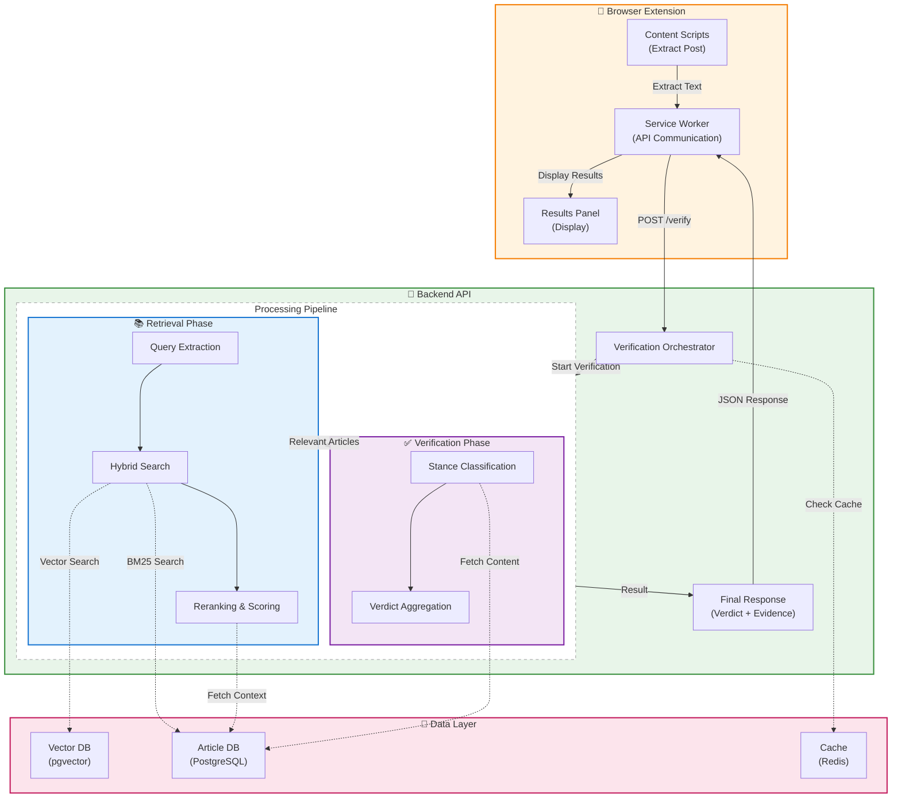
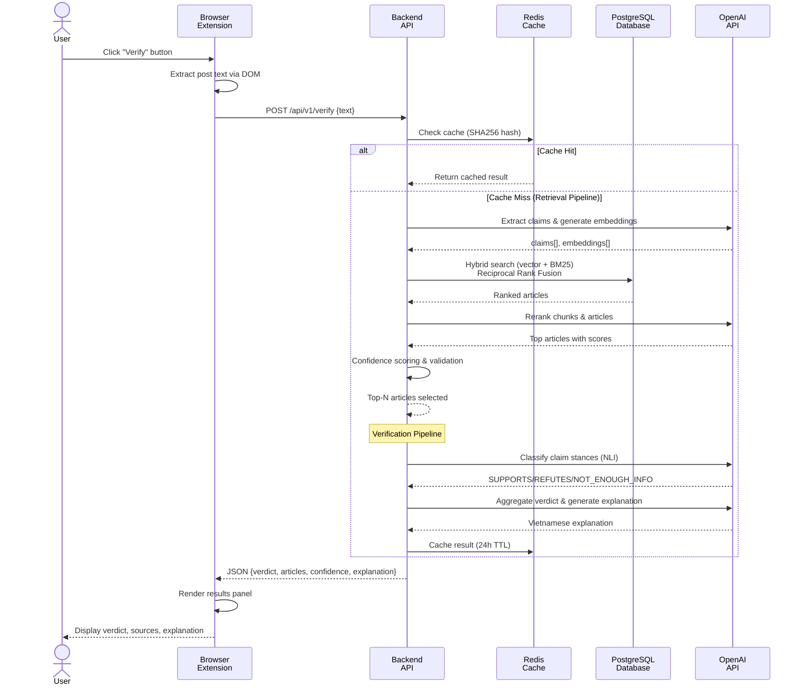
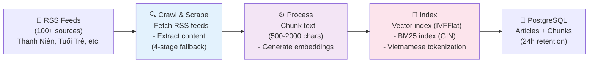

# 🏗️ VeriNews System Design

## High-Level Architecture



---

## Core Components

### 1. **Browser Extension (Frontend)**

#### 1.1 Content Scripts
- Inject "Verify" button into social media posts (Facebook, feeds, comments)
- Extract post text content using DOM traversal and MutationObserver
- Handle "See more" button expansion for full post text
- Handle user interactions (button clicks)
- **Note**: Image extraction not yet implemented

#### 1.2 Results Panel
- Show verification verdict (🟢 Fully Supported / 🟡 Partially Supported / 🔴 Refuted / ⚪ Not Enough Info)
- Display credibility score (0-100)
- Show Vietnamese explanation of verdict
- List linked trusted articles with relevance scores
- Display claim-by-claim breakdown
- Provide links to source articles for further reading

#### 1.3 Background Service Worker
- Manage API communication with backend (POST /api/v1/verify)
- Cache verification results locally (chrome.storage API)
- Handle request/response serialization
- Monitor extension health and API availability

---

### 2. **Backend API (FastAPI)**

**Endpoint**: `POST /api/v1/verify`

**Input Schema**:
```json
{
  "text": "string (10-10,000 characters)",
  "cache_bypass": "boolean (optional, default: false)"
}
```

#### 2.1 Verification Orchestrator
- **Role:** Central workflow coordinator and request handler
- **Location**: `backend/app/api/verification.py`
- **Responsibilities:**
  - Validate incoming verification requests
  - Check Redis cache for previous results (24-hour TTL)
  - Orchestrate retrieval and verification pipelines
  - Aggregate results from all services
  - Return structured JSON response to frontend
  - Cache results in Redis

#### 2.2 Retrieval Pipeline (3 Phases) - Query → Search → Score

**Location**: `backend/app/services/retrieval/`

1. **Query Extraction & Embedding**
   - LLM extracts claims and entities from post
   - OpenAI text-embedding-3-small generates 1536-dimensional vectors
   - Files: `query_extraction_service.py`, `embedding_service.py`

2. **Hybrid Search & Fusion**
   - **Vector Search**: pgvector with COSINE similarity
   - **BM25 Search**: PostgreSQL full-text search with Vietnamese tokenization
   - Reciprocal Rank Fusion (k=60) merges results
   - File: `retrieval_orchestrator.py`

3. **Reranking & Validation**
   - LLM reranks top-100 chunks and full articles (threshold: 5.0/10.0)
   - Multi-signal confidence scoring (5 weighted factors)
   - Final validation rejects results below confidence threshold (default 0.25)
   - Files: `chunk_reranking_service.py`, `article_reranking_service.py`, `confidence_scoring_service.py`

**Output**: List of most relevant articles with relevance scores and chunk details

#### 2.3 Verification Pipeline (2 Phases) - Classify → Aggregate

**Location**: `backend/app/services/verification/`

1. **Stance Classification**
   - NLI-based classification for each claim-article pair
   - Possible stances: **SUPPORTS**, **REFUTES**, **NOT_ENOUGH_INFO**
   - Minimum confidence threshold: 0.6 (60%)
   - Files: `stance_classifier_service.py`, `verification_service.py`

2. **Verdict Aggregation & Explanation**
   - Combines claim verdicts into overall assessment
   - Possible verdicts: **FULLY_SUPPORTED**, **PARTIALLY_SUPPORTED**, **REFUTED**, **NOT_ENOUGH_INFO**
   - Generates Vietnamese explanation with confidence scores and sources
   - File: `verdict_aggregator_service.py`, `explanation_generator_service.py`

**Output**: VerificationResult with verdict, confidence, explanation, and claim-by-claim breakdown

---

### 3. **Data Layer**

#### 3.1 Vector Database (pgvector in PostgreSQL)
**Location**: `ArticleChunk.embedding` column
- **Dimension**: 1536 floats (OpenAI embedding standard)
- **Index Type**: IVFFlat (Approximate Nearest Neighbor)
- **Index Config**: lists=100 (number of clusters)
- **Metric**: COSINE similarity
- **Query Speed**: ~10-100ms for top-k search
- **Storage**: ~1.5GB per 100K articles

#### 3.2 Trusted News Database (PostgreSQL)
**Tables**:
- **Article**: title, url, content, published_at, feed_id, created_at
- **ArticleChunk**: chunk_text, embedding, search_vector (BM25), article_title, source_name, published_at
- **RssFeed**: feed_url, topic, is_active, last_fetched_at, source_id
- **NewsSource**: name, website_url, topic

**Key Constraint**:
- Unique index on Article.url (prevents duplicate articles)
- Unique constraint on (ArticleChunk.article_id, chunk_index)
- Cascade deletes: Deleting Article cascades to ArticleChunk

#### 3.3 Full-Text Search (PostgreSQL tsvector + GIN Index)
**Column**: `ArticleChunk.search_vector`
- **Tokenization**: Vietnamese-aware using pyvi library
- **Config**: PostgreSQL 'simple' config (no stemming)
- **Index Type**: GIN (Generalized Inverted Index)
- **Purpose**: BM25-like keyword search for lexical matching

#### 3.4 Cache Layer (Redis)
**Purpose**: Cache verification results to avoid reprocessing
- **Key Format**: `retrieval:{SHA256(post_text)}`
- **Value**: Complete retrieval results (articles, timings, query count)
- **TTL**: 24 hours (configurable)
- **Hit Speed**: <50ms vs. 2.5-4.5s for cache miss
- **Also used**: Celery message broker for task queue

---

### 4. **Data Ingestion Pipeline (Background Celery Tasks)**

**Framework**: Celery 5.4+ with Beat scheduler
**Interval**: Every 5 minutes (configurable)
**Workers**: 4 parallel workers (configurable)

**3-Phase Process**:

1. **Crawl & Scrape** (`rss_service.py`, `scraper_service.py`)
   - Fetches RSS feeds from 100+ trusted sources (Thanh Niên, Tuổi Trẻ, Lào Cái)
   - Extracts content using 4-stage fallback: Trafilatura → MVP → BeautifulSoup
   - Deduplicates by URL, filters articles >48 hours old, rate-limits to 50/feed

2. **Process & Index** (`chunking_service.py`, `embedding_service.py`, `bm25_search_service.py`)
   - Chunks articles into 500-2000 character segments with denormalized metadata
   - Generates OpenAI embeddings (1536-dimensional vectors)
   - Creates vector index (pgvector IVFFlat) and BM25 index (PostgreSQL GIN) automatically

3. **Data Cleanup** (`cleanup_expired_articles` task)
   - Runs every 5 minutes alongside crawl
   - Deletes Article records >24 hours old (cascade deletes chunks)
   - Purpose: Prevent database bloat while maintaining fresh data for verification

---

## Data Flow

### Verification Request Flow (Simplified)



### Data Ingestion Flow (Background Pipeline)

**Note**: Data ingestion runs as a background Celery task every 5 minutes. Articles are retained for 24 hours and then automatically cleaned up.



---

## Technology Stack

### Frontend (Browser Extension)
- **Language:** JavaScript (ES6+)
- **Standard:** Manifest V3 (Chrome/Chromium 88+)
- **DOM Manipulation:** Native DOM API + MutationObserver
- **Storage:** Chrome Storage API (local)
- **Testing:** Jest + Puppeteer (headless Chrome)

### Backend
**Python 3.13+ with UV Package Manager**

**API Framework:**
- FastAPI 0.109+ (HTTP server)
- Pydantic 2.12+ (request/response validation)
- Uvicorn (async ASGI server)

**Async & Task Queue:**
- asyncio (built-in async runtime)
- Celery 5.4+ with Beat scheduler (task queue + scheduling)
- asyncpg (PostgreSQL async driver)

**Text Processing:**
- Trafilatura 1.8+ (content extraction)
- BeautifulSoup4 (HTML parsing)
- Readability-lxml (content detection)
- justext (boilerplate removal)
- PyVi 0.1+ (Vietnamese tokenization)

**AI/ML:**
- OpenAI Python SDK 1.3+ (embeddings + LLM APIs)
- scikit-learn (NLI-based stance classification)
- Loguru (structured logging)

**ORM & Migrations:**
- SQLAlchemy 2.0+ (async ORM)
- Alembic 1.13+ (database migrations)

**Data:**
- **Vector Database:** pgvector extension on PostgreSQL
- **Relational Database:** PostgreSQL 18
- **Cache:** Redis 7
- **Full-Text Search:** PostgreSQL built-in (tsvector + GIN index)

### Infrastructure
- **Containerization:** Docker + Docker Compose
- **Database Versioning:** Alembic (migrations)
- **Logging:** Loguru (structured logs to files)
- **Code Quality:** Ruff (linting + formatting)
- **Pre-commit:** Hooks for code quality

### AI Models & APIs
**Currently Implemented:**
- **Embeddings:** OpenAI text-embedding-3-small (1536-dim)
  - Cost: ~$0.00002 per 1K tokens
- **LLM (Query Extraction, Reranking):** GPT-4o-mini
  - Cost: ~$0.15/1M input tokens, $0.6/1M output tokens
- **LLM (Stance Classification):** GPT-4o-mini
  - Cost: ~$0.15/1M input tokens, $0.6/1M output tokens
- **LLM (Explanation Generation):** GPT-4o-mini

**Planned (Not Yet Implemented):**
- **Image Detection:** Third-party vision API (TBD - Google Vision, AWS Rekognition, Azure Computer Vision)

### Development Tools
- **Package Manager:** UV (fast pip alternative)
- **Database CLI:** psql + pgAdmin web interface
- **Task Monitoring:** Celery Flower (optional web UI)
- **API Documentation:** Swagger UI + ReDoc (auto-generated from FastAPI)
- **Testing Framework:** pytest + pytest-asyncio + pytest-cov

### Response Time Characteristics
- **Cache Hit**: 50-100ms
- **Cache Miss (Verification)**: 2.5-4.5 seconds
  - Query Extraction: 200-300ms
  - Embeddings: 300-600ms
  - Hybrid Search: 500-1,000ms
  - Reranking: 1,000-1,500ms
  - Verification: 1,000-2,000ms
